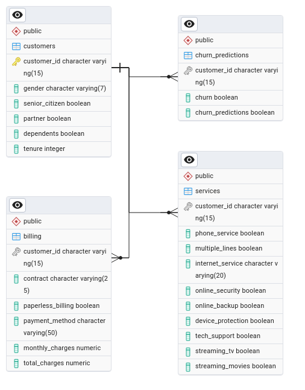

# Data-Science-Internship-Project 

This repository contains the project files for my Data Science internship at 10Pearls for their Shine Internship Program. 

## Project Overview
The objective of this project is to analyze customer churn data from a telecommunications company, develop a predictive model to identify customers who are likely to churn, and manage the data using SQL. Churn with a telecommunications company happens when a customer stops using the services of the telecommunication and might opt for another telecommunications company for services. There can be various reasons for churn, for example, poor service quality, high rates of services that are unable to meet the required standards, etc. The project aims to understand the reasons for customer churn patterns based on various factors, and be able to predict whether a customer is likely to churn or not. 

## Project Structure
The project is divided into four main modules:
- **Module 1: Python**
- **Module 2: AI Algorithm**
- **Module 3: SQL**
- **Module 4: Model Deployment**

## Data Set Overview
The dataset is available in the [data](data) folder as [Telco-Customer-Churn.csv](Telco-Customer-Churn.csv). Each row represents a customer, each column contains customer’s attributes described on the column Metadata.
**The dataset includes information about:**
- Customers who left within the last month – the column is called Churn
- Services that each customer has signed up for – phone, multiple lines, internet, online security, online backup, device protection, tech support, and streaming TV and movies
- Customer account information – how long they’ve been a customer, contract, payment method, paperless billing, monthly charges, and total charges
- Demographic info about customers – gender, age range, and if they have partners and dependents

---

## Modules
### 1. Python - Data Processing, EDA, and Feature Engineering

Some of the insights from the data set, included with visuals in the [Module 1 Task](Module_1_Python_DataProcessing/Data_Processing.ipynb) file are as follows:
1.  **Month-to-Month** contract types had the **highest churn** rates amongst all contract types
2. Customers with higher monthly charges yet lower total charges tend to churn more, this may indicate that they select a lot of services that result in a higher monthly charge, yet before it accumulates a lot to contribute to total charges, they churn. 
3. The above point is further strengthened by the fact that customers with lesser tenures show a higher churn rate than those with higher tenures. This indicates that customers with lesser monthly charges, but longer tenures show more loyalty to the teleco.
4. Customers with partners also have a lower churn rate than those without partners.
5. Customers paying via electronic check have the highest churn rates, which may indicate they are dissatisfied with this service, while customers with automatic payment methods (bank and credit card) have the lowest churn rates. 
6. Finally, we used SMOTE (Synthetic Minority Oversampling Technique) to generate synthetic data, to improve the performance of our model (without this, our model produced less accuracies as desired) 

### 2. AI Algorithm - Machine Learning Model Training, Tuning, Evaluation and Selection

The exported data set, from Module 1, was split into training and testing sets. 80% of the data was used for training the model, while 20% of the data was used for testing the model.

The set of models was as so:
- Logistic Regression
- Decision Trees
- Random Forest
- Gradient Boosting
- Support Vector Machine
- XGBoost
- Voting Classifier

The models were then tuned using Grid Search where appropriate, and then ranked based on various metrics. A table summary is shown below:

**Single Value Rankings:**

| Model | Accuracy | Precision | Recall | F1-Score | ROC-AUC | 
| --- | --- | --- | --- | --- | --- |
| Random Forest (Tuned) | 0.852163 | 0.857705 | 0.844416 | 0.851008 | 0.852163 |
| Logistic Regression (Tuned) | 0.850549 | 0.858179 | 0.839897 | 0.848940 | 0.850549 |
| XGBoost (Tuned) | 0.848935 | 0.844927 | 0.854745 | 0.849807 | 0.848935 |
| Voting Classifier | 0.849258 | 0.849483 | 0.848935 | 0.849209 | 0.849258 |
| Gradient Boosting (Tuned) | 0.846030 | 0.850785 | 0.839251 | 0.844979 | 0.846030 |
| Decision Tree (Tuned) | 0.813105 | 0.798645 | 0.837314 | 0.817523 | 0.813105 |
| Support Vector Machine | 0.654939 | 0.670940 | 0.608134 | 0.637995 | 0.654939 |

**Cross Validation (CV) Rankings:**
| Model | CV Accuracy | CV Precision | CV Recall | CV F1-Score | CV ROC-AUC |
| --- | --- | --- | --- | --- | --- |
| Voting Classifier | 0.839350 | 0.846102 | 0.827613 | 0.824278 | 0.937762 |
| Gradient Boosting (Tuned) | 0.837704 | 0.851368 | 0.817155 | 0.819202 | 0.935925 |
| XGBoost (Tuned) | 0.835864 | 0.843923 | 0.822191 | 0.819573 | 0.934392 |
| Random Forest (Tuned) | 0.834799 | 0.846160 | 0.815219 | 0.817304 | 0.930960 |
| Logistic Regression (Tuned) | 0.830441 | 0.853046 | 0.797593 | 0.808284 | 0.932601 |
| Decision Tree (Tuned) | 0.811844 | 0.808856 | 0.812896 | 0.802946 | 0.888857 |
| Support Vector Machine | 0.662211 | 0.677478 | 0.619602 | 0.647184 | 0.742601 |

**Best Models**
Based on the above values, the **Voting Classifier Model** and the **Random Forest Model** were evaluated to be the best models. The **Logistic Regression** and **Gradient Boosting models** also performed well coming in a close second.

### 3. SQL - Database Schema Design, SQL Queries and SQL Analysis
For the purposes of this project, a **PostgreSQL** database was used with **pgAdmin4** for database management. As per the details of the task given, the schema had 4 tables; customers, services, billing and churn predictions, each being linked with the **customer ID** as the key (primary for customers and foreign referenced for the other tables).
The ERD was then designed (in pgAdmin through ERD Tool) as so:

The SQL Queries have been documented in the [Scripts](Module_3_SQL_Analysis/sql_scripts/) directory.

The summary report along with insights is all mentioned in the [Module 3 SQL](Module_3_SQL_Analysis/sql_analysis.ipynb) file.

### 4. Model Deployment and API Consumption
The trained models were now deployed using a Flask Application along with API for consumption. The models were saved as a pickle file, and then loaded into the Flask application. The API was then created to consume the model, and the model was tested using `Curl`.

The complete documentation can be found in the [Module 4 Model Deployment](Module_4_Model_Deployment) directory in the [python notebook](model_depl_api.ipynb).

The deployed app can be accessed at [https://churn-predictor-10p-552a02dcfdbb.herokuapp.com/](https://churn-predictor-10p-552a02dcfdbb.herokuapp.com/)

---

## Acknowledgements
I am grateful for [10Pearls](www.10pearls.com) for providing me with this internship opportunity under their Shine Internship Program. It was an amazing learning opportunity, and a great 8 weeks. 

Special thanks to **Ummara Amin**, **Ambreen Gul** for making the onboarding process smooth, and a special thanks to **Syed Zainab Yousuf Zaidi** - our technical mentor for her mentorship during the internship. 